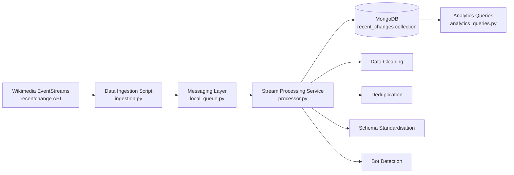

Wikipulse Architecture

```mermaid
flowchart LR
    A[Wikimedia EventStreams<br/>recentchange API] --> B[Data Ingestion Script<br/>ingestion.py]
    B --> C[Messaging Layer<br/>local_queue.py]
    C --> D[Stream Processing Service<br/>processor.py]
    D --> E[(MongoDB<br/>recent_changes collection)]
    E --> F[Analytics Queries<br/>analytics_queries.py]

    D --> G[Data Cleaning]
    D --> H[Deduplication]
    D --> I[Schema Standardisation]
    D --> J[Bot Detection]
```