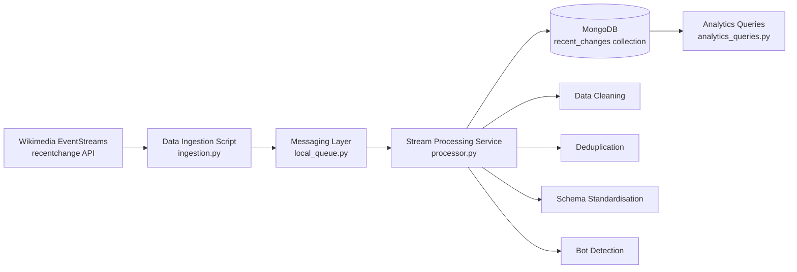

# Wikipulse Architecture



Data Flow
Wikipulse connects to Wikimedia EventStreams and receives live recent-change events. The ingestion script reads the stream and sends valid JSON events into the messaging layer. The processoe consumes events from the queue, cleans and standardizes the data, removes duplicates and writes processed records into MongoDB. Annalytics queries are the used to identify trending pages, active users and bot vs human activity.

Mongo Data Model
JSON
{
    "event_id": 123456,
    "wiki": enwiki,
    "type": edit,
    "namespace": 0,
    "title": "Example Page",
    "page_id": 98765,
    "revision_id": 111222,
    "old_revision_id": 111221,
    "user": "ExampleUser",
    "bot": false,
    "minor": false,
    "comment": "Updated section",
    "server_name": "en.wikipedia.org",
    "timestamp": "2026-05-02T10:00:00Z",
    "processed_at": "2026-05-02T10:00:03Z",
    "raw_event": {} 
}

Optional Google Cloud Pub/Sub Version
The local project uses 'local_queue.py' as a simulated message broker. In a production environment, Google Cloud Pub/Sub can replace the local queue.
Pub/Sub improves the system by adding:
- durable messaging
- better scalability
- retry handling
- independent publishers and subsribers
- fault tolerance

The optional Pub/Sub files are stored in:
```txt
pubsub_version/
|--pubsub_publisher.py
|--pubsub_subscriber.py

# Wikipulse Technical Report
Design Decisions - Wikipulse was designed usimg a modular,event-driven architecture consisting of ingestion, messaging, processing and storage layers. The system connects to Wikimedia EventStreams to capture live Wikipedia edits in real time. The messaging layer decouples ingestion from processing and as such improves the flexibility and reliabilty of the system.

Trade-offs Made
A local in-memory queue was ussed to simplify the development instead of a productiion-grade system like Pub/Sub. While this system is easy to implement, it lacks durability and fault tolerance.
MongoDB offers flexibility but sacrifices some strict schema enforcement found in relational databases.

Challenges Encountered
Handling real-time streaming data required managing unstable connections and implementing retry logic. The incoming data also contained missing or inconsistent fields, requiring validation and standardization.
Preventing duplicates was another challenge encountered. This was solved using event IDs and database indexing. Performance concerns due to high data volume were addressed by adding indexes on key fields such as timestamp, user and title.

Scalability
This is achieved through component separation and loose coupling. The message layer can be upgraded to Google Pub/Sub for distributed, fault-tolerant processing. MongoDB supports scalability through indexing and horizontal scaling.
